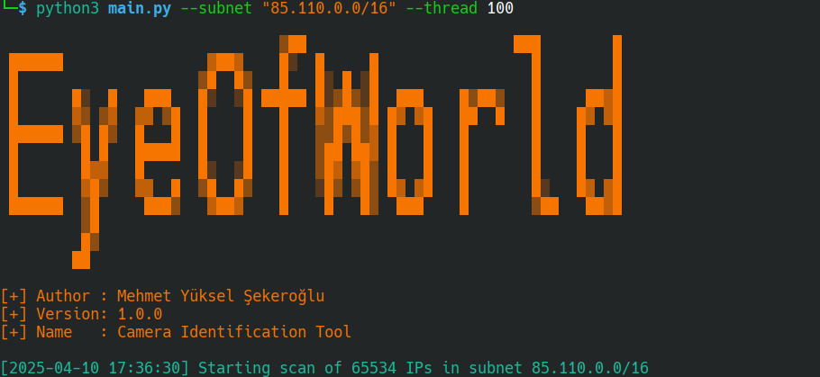
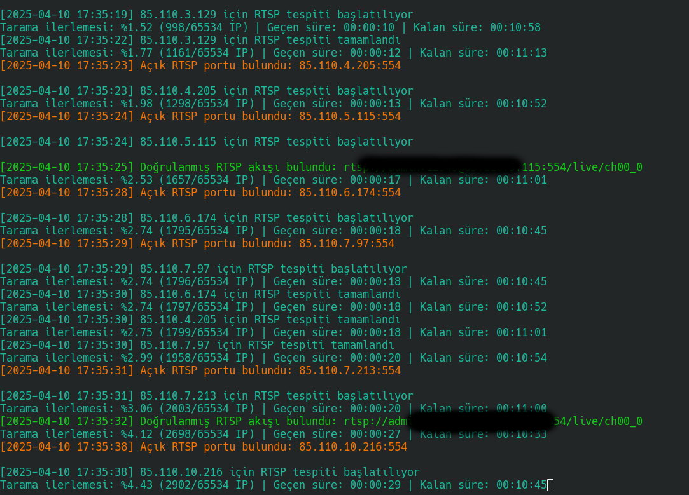

  

# IP Camera Discovery

IP Camera Discovery, IP tabanlı güvenlik kameralarını keşfetmeye, taramaya ve test etmeye yönelik kapsamlı bir araçtır.

## Dokümantasyon

Dokümantasyon için tercih ettiğiniz dili seçin:

- [English Documentation](doc/en/README.md)
- [Turkish Documentation](doc/tr/README.md)

## Özellikler

- 🔎 IP Tarama ve Port Kontrolü
- 👁 Kamera Modeli Tanımlama
- ⚡ Bruteforce Oturum Açma Testleri
- 🛠 Headless Tarayıcı Kullanımı
- ⚙ Paralel İşlem (Multi-threading)
- 🎦 RTSP Akış Keşfi ve Analizi

## Gereksinimler

- Python 3.x
- `pip install -r src/requirements.txt`

## Görseller

  

  

  

## Yazar

© 2023-2024 Mehmet Yüksel Şekeroğlu
